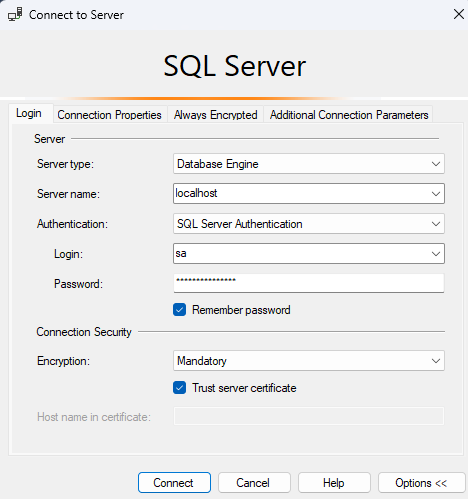

# CS 276 at LCC
Resources related to the Database Systems and Modeling course at Lane Community College

[Docker compose v2](https://docs.docker.com/compose/) must be installed to use this project

Requires Node / NPM be installed to use npm scripts. If using [NVM](https://github.com/nvm-sh/nvm), you can run `nvm use` to automatically use the correct version

# Spoiler Warning!
This project also includes completed assignments and course resources in the [coursework](./coursework/) directory. Avoid that directory (or delete it entirely) if you don't want any spoilers for the class!

# Running
This project uses Docker to host a MySql and a Microsoft SQL server, forwarding at the regular ports. The following commands are supported:
```sh
npm run docker:up   # Deploy the docker container
npm run docker:down # Delete the docker container and all volumes
```

A webapp is also included - [Adminer](https://www.adminer.org/) - in the docker container that can be used for easy administration of the hosted databases. It can be found by navigating to:

### http://localhost:8080

# Connecting
The databases can be connected to normally at localhost, since the regular ports are forwarded. To connect in Adminer, use the following settings:
| Input | Value |
|-------|-------|
| System | `MS SQL (beta)` |
| Server | `db` |
| Username | `sa` |
| Password | `aStrong(!)Password` |

## Connecting with SQL Server Management Studio
To log in to Microsoft SQL Server Management Studio, you will need to directly connect to localhost, instead of using the built-in database discovery wizard. Refer to the following screenshot for an example of how to log in:


